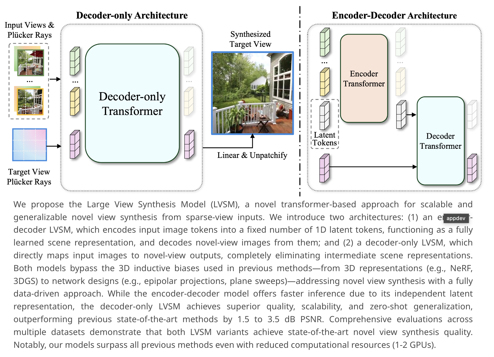
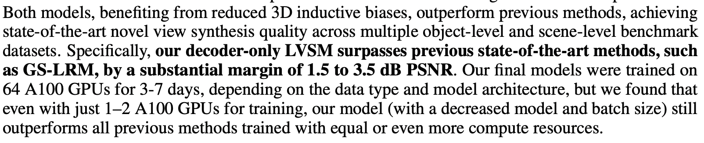

</img>

</img>

## LVSM - Pytorch (wip)

Implementation of [LVSM](https://haian-jin.github.io/projects/LVSM/), Large View Synthesis with Minimal 3d Inductive Bias, from Adobe Research

We will focus only on the Decoder-only architecture in this repository.

This paper lines up with <a href="https://openreview.net/forum?id=A8Vuf2e8y6">another</a> from ICLR 2025

## Citations

```bibtex
@inproceedings{Jin2024LVSMAL,
    title={LVSM: A Large View Synthesis Model with Minimal 3D Inductive Bias},
    author={Haian Jin and Hanwen Jiang and Hao Tan and Kai Zhang and Sai Bi and Tianyuan Zhang and Fujun Luan and Noah Snavely and Zexiang Xu},
    year={2024},
    url={https://api.semanticscholar.org/CorpusID:273507016}
}
```
